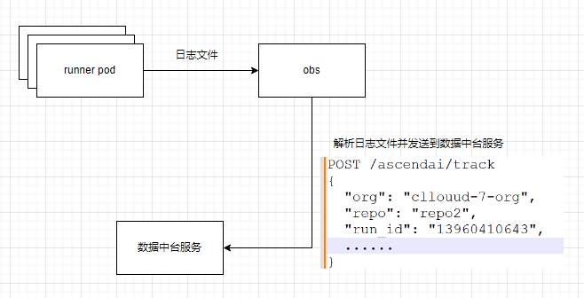
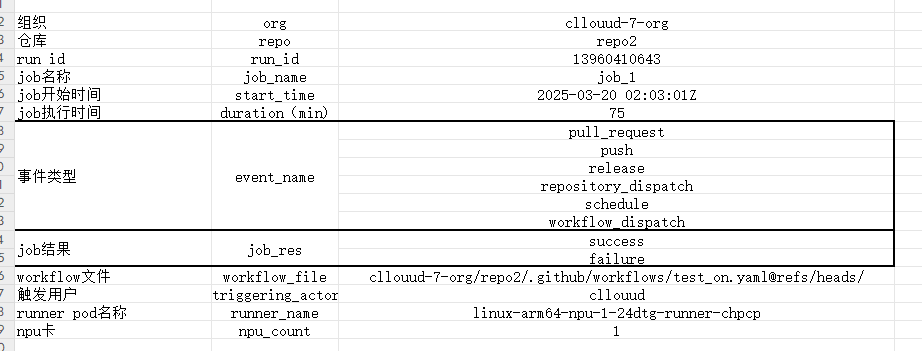

# 监控runners
记录 NPU runner 执行的CI信息，用于年度总结，合理分配NPU资源。

## metrics
1. 每个任务的运行情况:由谁触发，起止时间，组织仓库，`workflow url`和`action run id`,运行结果。
2. arc层面的总体指标：当前接入哪些组织/仓库。历史任务的数量，组织/仓库分布。历史任务的成功/失败比例。这些指标由runner任务数据聚合得到。

## 实现方式
流程：将pod的标准日志存入obs桶，起一个服务将obs桶的数据解析后转成字段，发给数据中台服务。

字段：
